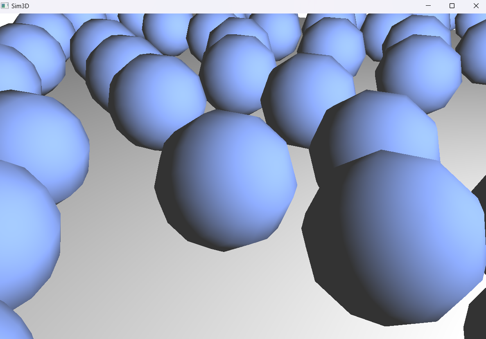
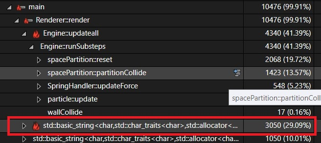
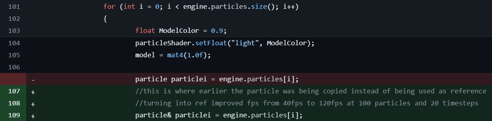

# Sim3d Phase 2 Devlog

## Introduction

Hello everyone and welcome to Phase 2 of the Sim3D development log. This phase deals with building on top of our previous setup and adding improvements and fixes. We considered each part of the complex system and thought of ways in which it could be improved and enhanced.

## Phase 2 Objectives

- Adding smooth shading and Phong lighting
- Experimenting with octree node and multi-threading
- Finalizing space partitioning
- Fixing memory leaks and optimizing `std:vector` and `std:string`
- Multiple point light support, more realistic lighting with attenuation and specular highlights
- Adding ImGui

Throughout this document, we will try to cover and explain each of the above topics in detail, so that anybody trying to implement the project for themselves can get a much clearer idea.

## Development Process

### Step 1: Adding smooth shading and Phong lighting


#### Old method (V1, N1, V2, N2, V3, N3):

assigned different normals to shared vertices, causing abrupt color changes between triangles.

```cpp
pushVec3(vertices, v1); // point
pushVec3(vertices, normal);
pushVec3(vertices, v2);
pushVec3(vertices, normal);
pushVec3(vertices, v3);
pushVec3(vertices, normal);

```

#### New approach (V1, V1, V2, V2, V3, V3)

uses an OpenGL trick. For spheres, vertex positions equal normal directions. This allows OpenGL to interpolate data smoothly between shaders, creating the illusion of a curved surface with smooth color transitions.

```cpp
pushVec3(vertices, v1); //vertex1
pushVec3(vertices, v1);
pushVec3(vertices, v2); //vertex2
pushVec3(vertices, v2);
pushVec3(vertices, v3); //vertex3
pushVec3(vertices, v3);
```


Flat shading without specular highlights:



#### Phong Lighting Model

This lighting model has three components:

1. **Ambient lighting**: A constant base illumination simulating indirect light.

2. **Lambertian Diffuse**: Light scattered from matte surfaces.

   - Intensity calculated as: $N \times L$
   - Where N is the surface normal and L is the light direction

3. **Specular Reflection**: Bright highlights on shiny surfaces.
   - Intensity calculated as: $(R\times V)^n$
   - Where:
     - $R = 2(N\times L)N - L$ (reflection vector)
     - $V$ is the view vector
     - $n$ is the shininess factortensity calculated as $(R\times V)^n$, where:

This model tries to implementing lighting similar to the real world, but without complicated calculations.

Even at low poly count, flat shading + phong lighting gives illusion of smooth detailed spheres


```glsl
FragmentShader.glsl
    // diffuse
    vec3 norm = normalize(Normal);
    vec3 lightDir = normalize(-FragPos);
    float diff = max(dot(norm, lightDir), 0.0);

    //specular
    float specularStrength = 0.3f;
    vec3 viewDir = normalize(cameraPos - FragPos);
    vec3 reflectDir = reflect(-lightDir, norm);
    float spec = pow(max(dot(viewDir, reflectDir), 0.0), 25);
    float specular = specularStrength * spec;
```

### Step 2: Experimenting with octree node and multi-threading

As our Sim 3D physics engine evolved, we encountered a significant performance bottleneck in our collision detection system. Our initial approach of brute-force checking of collisions between every pair of particles, while straightforward, proved to be computationally expensive with a runtime complexity of $O(n²)$. To address this challenge, we implemented a grid-based collision detection system.

For this, we first thought of implementing a recursive grid based collision system using `Octreenode`. An octree is a recursive tree data structure where each internal node has exactly eight children, often used in 3D graphics and spatial partitioning. [Take a look here!](https://github.com/ttvd/spatial-collision-datastructures/blob/master/Octree.cpp)


Our implementation involved creating a single `root` instance of the `OctreeNode` class and recursively dividing a parent into many children if the particle limit was exceeded. This ensured that the data structure automatically balanced itself based on the local density of the particles and hence was extremely efficient and accurate.

```cpp
class OctreeNode
{
private:
	vec3 minBound, maxBound;
	std::vector<particle> particles;	// stores particles contained in this node
	OctreeNode* children[8];	// pointers to child nodes

public:
	const int MAX_PARTICLE_PER_NODE = 8;
	OctreeNode(vec3 minBound, vec3 maxBound);
	void subdivideNode();
	void insertParticle(particle& particle);
	void removeParticle(particle& particle);
	void update();
};
```

Collisions were now being detected only between particles on neighbouring cells. This ensured we that avoid unnecessary collision check between particles far away. This alone significantly improved out time complexity to $O(n\times log(n))$.

However, we gradually realized that this approach would be too complex and an overkill for our simple use case. The recursive nature of the octree system introduced unnecessary complexity, making it harder to maintain and extend.

To address this, we switched to a Space Partition based system using a fixed grid structure, which is simpler and more straightforward.

### Step 3: Finalizing space partitioning

The SpacePartition class was hence defined with properties such as `boxsize` to store the size of each cell as a `vec3`

The core of our implementation revolves around the SpacePartition class, which manages the overall grid structure:

```cpp
class spacePartition {
private:
    Engine& engine;
    int subDivs;
    std::vector<partition> partitions;
    vec3 worldmin, worldmax, worldsize, boxsize;

public:
    spacePartition(Engine& engine, int divisions);
    void createGrid(vec3 min, vec3 max);
    void setParticles(std::vector<particle>& particles);
    int getCellIndex(vec3 pos);
    void partitionCollide();
    void reset();
}
```

The createGrid function divides the simulation space into a 3D grid of cells:

```cpp
void spacePartition::createGrid(vec3 min, vec3 max)
{
    worldmax = max; worldmin = min;
    partitions.reserve((int)pow(subDivs, 3));

    worldsize = worldmax - worldmin;
    boxsize = worldsize / (float)subDivs;
    vec3 boxmin(worldmin), boxmax = boxmin + boxsize;

    // ... (code to create grid cells)
}
```

The collision detection is then performed within each cell, significantly reducing the number of checks required:

```cpp
void spacePartition::partitionCollide()
{
    float elasticity = engine.particleElasticity;
    for (auto& part : partitions)
    {
        const std::vector<particle*>& group = part.group;
        int size = group.size();
        for (int i = 0; i < size - 1; i++)
        {
            for (int j = i + 1; j < size; j++)
            {
                if (isCollision(*group[i], *group[j]))
                {
                    resolveCollision(*group[i], *group[j], elasticity);
                }
            }
        }
    }
}
```

This approach dramatically improved our collision detection performance by avoiding unnecessary checks between distant particles. The result is a more efficient simulation that can handle a larger number of particles while maintaining real-time performance.


Just take a look at the difference in FPS with and without space partioning in similar conditions!


Key takeaways for those implementing a similar system:

- Efficient spatial hashing: The getCellIndex function quickly determines which cell a particle belongs to.

- Multi-cell particle handling: Particles that overlap multiple cells are added to all relevant cells to ensure accurate collision detection.
- Grid resolution balance: Adjust the subDivs parameter to optimize performance for your specific use case.

By sharing our experience and code, we hope to provide valuable insights for others working on particle-based physics simulations, enabling them to overcome similar performance challenges in their projects.

### Step 4: Fixing memory leaks and optimizing std:vector and std:string

When we finally reached a stable version of our engine, we thought of fixing some bugs and optimizing our code even more to squeeze out as many frames as possible with limited resources.

For this we carefully analyzed every component of our codebase and used extensive debugging and profiling tools available in Visual Studio to aid in this process. Here are some of the issues that we noticed and made optimizations to it:

- In our ongoing efforts to optimize the performance of our physics engine, we focused on enhancing particle creation and rendering processes. For this we replaced `std::vector.push_back()` with `std::vector.emplace_back()` which direclty creates new particle objects inside the vector instead of copying them.
  
  Additionally, we reserved memory for the particle vector upfront using `particles.reserve(numParticles)`, which prevents multiple reallocations and further improves initialization speed.
  
- We also minimized `std::string` to `char*` conversion and vice-versa inside shader.h 
  This fixed the issue of full template instantiation of `std::string`, which was previously consuming **29.09%** of the total execution time. 
- We also shifted to referce pointers wherever possible including inside the render loop instead of copying obejcts. Turning into reference alone improved FPS from 40fps to 120fps at 100 particles and 20 timesteps 
- Here are some profiling screenshots showing performance differences with and without space partitioning.


### Step 5: Multiple point light support, more realistic lighting with attenuation.

At this point we only had a very primitive light source, by just defining the position of the light and calculating fragment color accordingly.
We solve this by abstracting this into a `pointLight` as such

```cpp
struct pointLight {
	vec3 pos;
	vec3 color;
	float intensity;
	float attenuation;

	pointLight() : pos(vec3(0)), color(vec3(1)), intensity(1), attenuation(1.0f) {}
	pointLight(vec3 position, vec3 col, float inten) : pos(position), color(col), intensity(inten), attenuation(1)
	{}
};
```

And we configure the Fragment Shader to accept these objects as uniforms

```glsl
#version 330 core
#define MAXLIGHTS 10

out vec4 FragColor;

in vec3 Normal;
in vec3 localPos;
float attenuation;

uniform pointLight ourlights[MAXLIGHTS];
uniform int numlights;
```

We also render the light sources as spheres of the given color,
This adds so much realism to the engine!


Also we add the attenuation factor, which makes the insensity of light inversely proportional to the square of distance from the fragment.

```glsl
float factor = 1/(1.0 + att * dist * dist);
```

Summing up the Fragment color for all lights to get the result.

Turning up the attenuation factor high means the room appears very dimly lit, giving us a nice aesthetic!


### Step 6: Adding ImGui

To enhance user interaction and provide dynamic control over environment settings such as engine parameters (acceleration, friction, elasticity, velocity), lighting settings, and simulation behaviour, we decided to integrate a graphical user interface (GUI) into our project.

After considering various options, we chose [Dear ImGui](https://github.com/ocornut/imgui), a popular and lightweight GUI library for C++. Dear ImGui is a bloat-free graphical user interface library for C++. It outputs optimized vertex buffers that you can render anytime in your 3D-pipeline-enabled application. It is fast, portable, renderer agnostic, and self-contained (no external dependencies).


For this we created a separate `GUI` class to abstract all the internal inplmentation of ImGui library.

```cpp
GUI::GUI(Engine& ourengine, Renderer& renderer) :  engine(ourengine), renderer(renderer), window(renderer.window)
{
	// Setup Dear ImGui context
  IMGUI_CHECKVERSION();
  ImGui::CreateContext();
  ImGuiIO& io = ImGui::GetIO();
  ptrio = &io;
  // ... more configuartion code
  ImGui_ImplOpenGL3_Init();
  ImGui::StyleColorsDark();
}
```

`InitFrame()` is called at initialization to start a new GUI frame.

```cpp
void GUI::InitFrame()
{
	ImGui_ImplOpenGL3_NewFrame();
	ImGui_ImplGlfw_NewFrame();
	ImGui::NewFrame();
}
```

The `render()` function is the main part that is called inside the render loop and renders the different UI components to the screen.

```cpp
void GUI::render()
{
	// render your GUI
	ImGui::SetNextWindowPos(ImVec2(0, 0));
	ImGui::SetNextWindowSize(ImVec2(400, 0));

	ImGui::Begin("Debug Menu");

	ImGui::Checkbox("Pause Sim3D", &engine.pause);
	ImGui::Checkbox("Use Multi-threading", &engine.useThreading);
	ImGui::Checkbox("Use Space-partitioning", &engine.usePartition);
	ImGui::SliderInt("Number of Threads", &engine.m_NumThreads, 1, 12);
  // ...more GUI components

	ImGui::End();
	// Render dear imgui into screen
	ImGui::Render();
	ImGui_ImplOpenGL3_RenderDrawData(ImGui::GetDrawData());
}
```

The following code is called when the simulation is terminated to dispose off the GUI.

```cpp
// dispose off the GUI
void GUI::shutdown()
{
	ImGui_ImplOpenGL3_Shutdown();
	ImGui_ImplGlfw_Shutdown();
	ImGui::DestroyContext();
}
```

## References

- <https://en.wikipedia.org/wiki/Phong_reflection_model>
- <https://en.wikipedia.org/wiki/Phong_shading>
- <https://developer.mozilla.org/en-US/docs/Games/Techniques/3D_collision_detection>
- <http://buildnewgames.com/broad-phase-collision-detection/>
- <https://www.mikechambers.com/blog/files/quadtree/examples/collision.html>
- <https://docs.taichi-lang.org/blog/acclerate-collision-detection-with-taichi>
- <https://phramebuffer.wordpress.com/hierarchical-grids-collision-detection>
- <https://github.com/ocornut/imgui>
- <https://www.youtube.com/watch?v=5zS-DZhCA2g>

## Conclusion

In the first phase we built a solid fondation for our engine. This second phase build on top of that. We added a lot more complex features whilst also focusing on optimization and efficiency.

We integrated smooth shading and Phong lighting for realistic visuals, and switched from a complex octree system to an efficient fixed grid space partitioning for better performance. Optimizing memory management and `std::vector` usage further boosted efficiency.

Adding multiple point lights and attenuation improved realism, while integrating Dear ImGui provided a dynamic interface for real-time adjustments. These advancements have solidified Sim3D as a robust and efficient physics engine, ready for more complex simulations.

Do not forget to checkout the [project repo](https://github.com/anm-ol/sim3d) and [video demos](https://drive.google.com/drive/folders/1nFc3mQxkdXiyKRYAOJt7U238RMuw29qV?usp=drive_link) of our engine. If you have any queries, suggestions or feedback, please reach out to us [here](mailto:anmolagrawal5704@gmail.com)!

Also stay tuned for the upcoming last and final 3rd devlog of this entire series! Thank you for showing interest in [Sim3d](https://github.com/anm-ol/sim3d).
